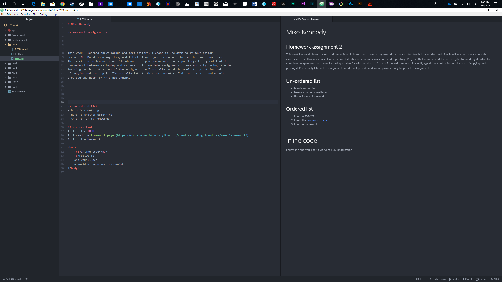

# Mike Kennedy

## Homework assignment 2

This week I learned about markup and text editors. I chose to use atom as my text editor
because Mr. Musik is using this, and I feel it will just be easiest to use the exact same one.
This week I also learned about Github and set up a new account and repository. It's great that i
can network between my laptop and my desktop to complete assignments. I was actually having trouble
focusing on the text 2 part of the assignment so I actually typed the whole thing out instead
of copying and pasting it. I'm actually late to this assignment so I did not provide and wasn't
provided any help for this assignment.

## Un-ordered list
- here is something
- here is another something
- this is for my Homework

## Ordered list
1. I do the TODO'S
2. I read the [homework page](https://montana-media-arts.github.io/creative-coding-1/modules/week-2/homework/)
3. I do the homework

<body>
    <h1>Inline code</h1>
    
Follow me
    and you'll see
    a world of pure imagination

</body>

