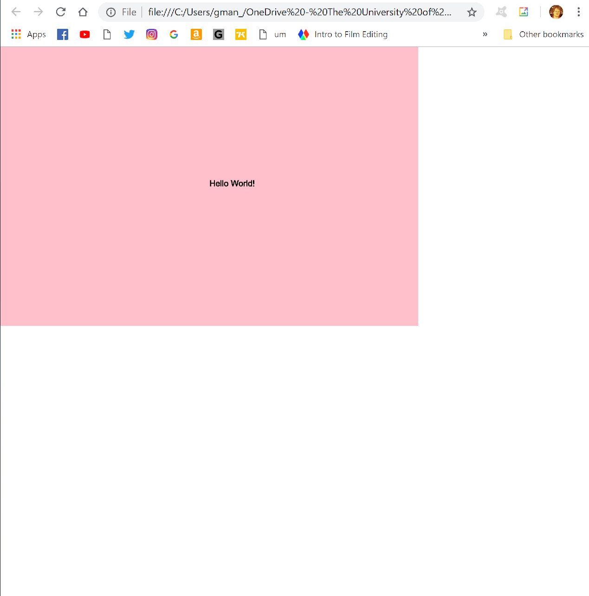

Mike Kennedy

["Hello World!"](https://mkennedy87.github.io/120-work/hw-3/)

# HW-3 Response

This week I was introduced to p5.js and I am liking it. It really does feel like learning an additional language that I'll soon be able to put together to make a coherent sketch. There were a few times where I totally screwed up the code and had to go back and forth serveral times wondering what else was wrong with my code each time.
I mostly used the videos to help me get through the lesson but I also read along at the same time with the video.

## Final sketch

